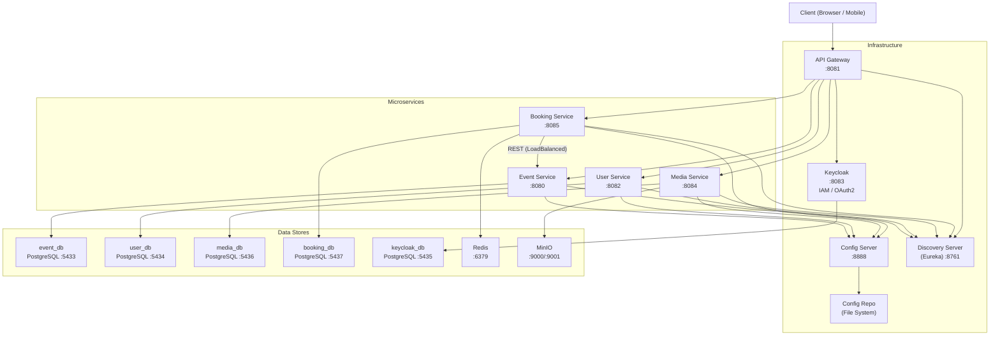
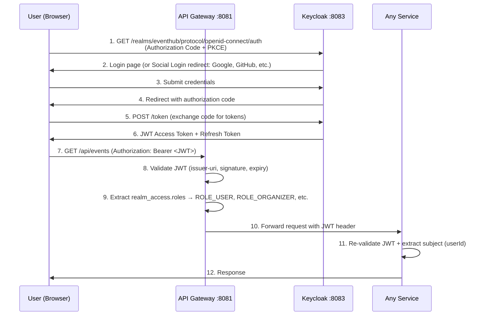
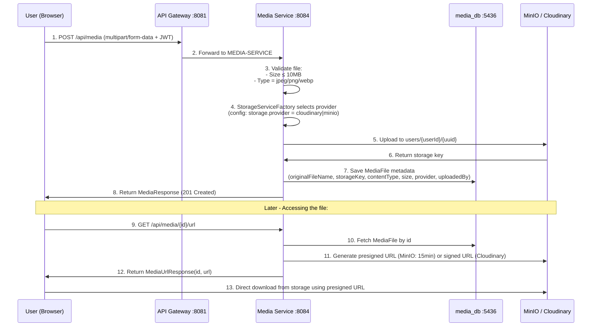

# EventHub — Complete Project Documentation

> **Last Updated:** 2026-09-21
> **Status:** In Development — Concurrency fix for Ticket Type in Booking Service is **IN PROGRESS** (reservation infrastructure is built; the atomic reserve is NOT yet wired into `createBooking`).

---

## Table of Contents

1. [Project Overview](#1-project-overview)
2. [Architecture Diagram](#2-architecture-diagram)
3. [Technology Stack](#3-technology-stack)
4. [Infrastructure Services](#4-infrastructure-services)
   - 4.1 [Docker Compose](#41-docker-compose)
   - 4.2 [Config Server](#42-config-server)
   - 4.3 [Config Repo](#43-config-repo-centralized-configuration)
   - 4.4 [Discovery Server (Eureka)](#44-discovery-server-eureka)
   - 4.5 [API Gateway](#45-api-gateway)
5. [Event Service](#5-event-service)
6. [Booking Service](#6-booking-service--active-task-area)
7. [User Service](#7-user-service)
8. [Media Service](#8-media-service)
9. [Cross-Cutting Concerns](#9-cross-cutting-concerns)
   - 9.6 [Social Login / OAuth2 Flow (End-to-End)](#96-social-login--oauth2-flow-end-to-end)
   - 9.7 [File Upload Flow (End-to-End)](#97-file-upload-flow-end-to-end)
   - 9.8 [Redis Usage Patterns](#98-redis-usage-patterns-dedicated-section)
10. [The Concurrency Bug (Active Task)](#10-the-concurrency-bug--active-task)
11. [Roadmap: Future Work & Recommendations](#11-roadmap-future-work--recommendations)
12. [Appendices](#12-appendices)

---

## 1. Project Overview

**EventHub** is a microservices-based event management and ticketing platform. Users can browse events, organizers can create and manage events with multiple ticket types, and attendees can book tickets. The system includes media management (profile pictures, event images), user profiles synced with Keycloak, and a reservation system with automatic expiration.

### Key Business Flows

1. **Organizer creates an Event** → Adds Ticket Types (VIP, General, etc.) with price and capacity.
2. **User books tickets** → System creates a `PENDING` booking → A Redis reservation is created with a 10-minute TTL.
3. **If user doesn't confirm within 10 minutes** → Redis key expires → Listener fires → Booking status changes to `EXPIRED`.
4. **User cancels** → Booking marked `CANCELLED` → Redis reservation deleted.

### Project Purpose & Learning Goals

> [!IMPORTANT]
> This is a **portfolio / learning project** built to demonstrate practical experience with four core backend skills:

| Skill Area | Where It's Applied in EventHub |
|---|---|
| **Social Login / OAuth2** | Keycloak as the Identity Provider. All services act as OAuth2 Resource Servers validating JWTs. The API Gateway enforces authentication. Users log in via Keycloak's OpenID Connect flow (Authorization Code + PKCE). User-service auto-creates profiles from JWT claims on first login (`getOrCreateCurrentUser`). |
| **File Upload** | Media-service handles multipart file uploads with validation (type, size). Uses a Strategy Pattern to support both MinIO (self-hosted S3) and Cloudinary (cloud CDN). Generates presigned/signed URLs for secure access. |
| **Microservices Architecture** | 4 business services + 3 infrastructure services. Each service has its own database (Database-per-Service pattern). Inter-service communication via REST + Eureka load balancing. Centralized config via Config Server. Single entry point via API Gateway. |
| **Redis** | 3 distinct usage patterns: (1) Temporary reservation storage with TTL, (2) Keyspace expiration notifications triggering booking expiry, (3) Atomic counters for ticket capacity tracking (infrastructure built, wiring in progress). |

---

## 2. Architecture Diagram



---

## 3. Technology Stack

| Layer | Technology | Version |
|---|---|---|
| **Language** | Java | 17 |
| **Framework** | Spring Boot | 4.1.1 |
| **Cloud** | Spring Cloud | 2025.1.3 |
| **Service Discovery** | Netflix Eureka | (Spring Cloud managed) |
| **API Gateway** | Spring Cloud Gateway (WebFlux) | (Spring Cloud managed) |
| **Config Management** | Spring Cloud Config Server | (Spring Cloud managed) |
| **Auth / IAM** | Keycloak | 26.7.3 |
| **Database** | PostgreSQL | 16 |
| **Cache / Pub-Sub** | Redis | 7 (Alpine) |
| **Object Storage** | MinIO (+ Cloudinary as alternative) | Latest |
| **API Docs** | SpringDoc OpenAPI (Swagger UI) | 3.1.x |
| **Build Tool** | Maven | (wrapper included) |
| **ORM** | Hibernate / Spring Data JPA | (Spring Boot managed) |

---

## 4. Infrastructure Services

### 4.1 Docker Compose

**File:** [docker-compose.yml](file:///d:/EventHub/docker-compose.yml)

Defines all infrastructure containers:

| Service | Image | Container Name | Host Port → Container Port | Volume |
|---|---|---|---|---|
| `event_db` | `postgres:16` | `eventhub_event_db` | `5433:5432` | `event_db_data` |
| `user_db` | `postgres:16` | `eventhub_user_db` | `5434:5432` | `user_db_data` |
| `keycloak_db` | `postgres:16` | `eventhub_keycloak_db` | `5435:5432` | `keycloak_db_data` |
| `keycloak` | `keycloak:26.7.3` | `eventhub_keycloak` | `8083:8080` | — |
| `media-db` | `postgres:16` | `eventhub_media_db` | `5436:5432` | `media_db_data` |
| `booking-db` | `postgres:16` | `eventhub_booking_db` | `5437:5432` | `booking_db_data` |
| `minio` | `minio:latest` | `eventhub_minio` | `9000:9000`, `9001:9001` | `minio_data` |
| `redis` | `redis:7-alpine` | `eventhub-redis` | `6379:6379` | — |

> [!IMPORTANT]
> Redis is started with `--notify-keyspace-events Ex` which enables keyspace expiration notifications. This is **critical** for the booking reservation TTL mechanism.

**Keycloak Credentials:** `admin` / `admin123`
**All DB Credentials:** `eventhub` / `eventhub123` (Keycloak DB: `keycloak` / `keycloak123`)

---

### 4.2 Config Server

**Directory:** `d:\EventHub\config-server`
**Port:** `8888`

**Application File:** [application.yml](file:///d:/EventHub/config-server/src/main/resources/application.yml)
```yaml
spring:
  application:
    name: config-server
  cloud:
    config:
      server:
        git:
          uri: file:///D:/EventHub/config-repo
          default-label: main
server:
  port: 8888
```

**Main Class:** [ConfigServerApplication.java](file:///d:/EventHub/config-server/src/main/java/com/eventhub/config_server/ConfigServerApplication.java) — Annotated with `@EnableConfigServer`.

**Dependencies:** `spring-cloud-config-server`.

---

### 4.3 Config Repo (Centralized Configuration)

**Directory:** `d:\EventHub\config-repo` (Git repository)

Contains YAML configuration for every service:

#### [event-service.yml](file:///d:/EventHub/config-repo/event-service.yml)
```yaml
server:
  port: 8080
spring:
  datasource:
    url: jdbc:postgresql://127.0.0.1:5433/eventhub_event_db
    username: eventhub
    password: ${EVENT_DB_PASSWORD:eventhub123}
  jpa:
    hibernate:
      ddl-auto: update
    show-sql: true
    open-in-view: false
  security:
    oauth2:
      resourceserver:
        jwt:
          issuer-uri: http://localhost:8083/realms/eventhub
eureka:
  client:
    service-url:
      defaultZone: http://localhost:8761/eureka/
  instance:
    hostname: localhost
    instance-id: ${spring.application.name}:${server.port}
springdoc:
  swagger-ui:
    oauth:
      client-id: eventhub-web
      use-pkce-with-authorization-code-grant: true
```

#### [user-service.yml](file:///d:/EventHub/config-repo/user-service.yml)
```yaml
server:
  port: 8082
spring:
  datasource:
    url: jdbc:postgresql://127.0.0.1:5434/eventhub_user_db
    username: eventhub
    password: ${USER_DB_PASSWORD:eventhub123}
  jpa:
    hibernate:
      ddl-auto: update
    show-sql: true
    open-in-view: false
  security:
    oauth2:
      resourceserver:
        jwt:
          issuer-uri: http://localhost:8083/realms/eventhub
```

#### [media-service.yml](file:///d:/EventHub/config-repo/media-service.yml)
```yaml
server:
  port: 8084
spring:
  servlet:
    multipart:
      max-file-size: 10MB
      max-request-size: 10MB
  datasource:
    url: jdbc:postgresql://localhost:5436/eventhub_media_db
    username: eventhub
    password: eventhub123
  jpa:
    hibernate:
      ddl-auto: update
    show-sql: true
  security:
    oauth2:
      resourceserver:
        jwt:
          issuer-uri: http://localhost:8083/realms/eventhub
storage:
  provider: cloudinary
minio:
  enabled: true
  endpoint: http://localhost:9000
  access-key: eventhub
  secret-key: eventhub123
  bucket: eventhub-media
cloudinary:
  enabled: true
  cloud-name: ${CLOUDINARY_CLOUD_NAME}
  api-key: ${CLOUDINARY_API_KEY}
  api-secret: ${CLOUDINARY_API_SECRET}
```

#### [booking-service.yml](file:///d:/EventHub/config-repo/booking-service.yml)
```yaml
server:
  port: 8085
spring:
  datasource:
    url: jdbc:postgresql://127.0.0.1:5437/eventhub_booking_db
    username: eventhub
    password: ${BOOKING_DB_PASSWORD:eventhub123}
  jpa:
    hibernate:
      ddl-auto: update
    show-sql: true
    open-in-view: false
  data:
    redis:
      host: localhost
      port: 6379
  security:
    oauth2:
      resourceserver:
        jwt:
          issuer-uri: http://localhost:8083/realms/eventhub
booking:
  reservation:
    ttl: 10m
```

#### [api-gateway.yml](file:///d:/EventHub/config-repo/api-gateway.yml)
```yaml
server:
  port: 8081
spring:
  cloud:
    gateway:
      server:
        webflux:
          routes:
            - id: event-service-route
              uri: lb://EVENT-SERVICE
              predicates:
                - Path=/api/events,/api/events/**,/api/categories,/api/categories/**
            - id: user-service-route
              uri: lb://USER-SERVICE
              predicates:
                - Path=/api/users,/api/users/**
            - id: media-service
              uri: lb://MEDIA-SERVICE
              predicates:
                - Path=/api/media/**
            - id: booking-service
              uri: lb://BOOKING-SERVICE
              predicates:
                - Path=/api/bookings,/api/bookings/**
  security:
    oauth2:
      resourceserver:
        jwt:
          issuer-uri: http://localhost:8083/realms/eventhub
eureka:
  client:
    service-url:
      defaultZone: http://localhost:8761/eureka/
```

#### [discovery-server.yml](file:///d:/EventHub/config-repo/discovery-server.yml)
```yaml
server:
  port: 8761
eureka:
  client:
    register-with-eureka: false
    fetch-registry: false
```

---

### 4.4 Discovery Server (Eureka)

**Directory:** `d:\EventHub\discovery-server`
**Port:** `8761`

**Main Class:** [DiscoveryServerApplication.java](file:///d:/EventHub/discovery-server/src/main/java/com/eventhub/discovery_server/DiscoveryServerApplication.java) — Annotated with `@EnableEurekaServer`.
**Dependencies:** `spring-cloud-starter-netflix-eureka-server`, `spring-cloud-starter-config`.

---

### 4.5 API Gateway

**Directory:** `d:\EventHub\api-gateway`
**Port:** `8081`

**Dependencies:** `spring-cloud-starter-gateway-server-webflux`, `eureka-client`, `oauth2-resource-server`, `config`, `loadbalancer`.

#### Security Config — [SecurityConfig.java](file:///d:/EventHub/api-gateway/src/main/java/com/eventhub/api_gateway/config/SecurityConfig.java)

```java
@Configuration
@EnableWebFluxSecurity
public class SecurityConfig {
    @Bean
    public SecurityWebFilterChain securityWebFilterChain(ServerHttpSecurity http) {
        KeycloakJwtAuthenticationConverter converter = new KeycloakJwtAuthenticationConverter();
        return http
                .csrf(csrf -> csrf.disable())
                .authorizeExchange(exchange -> exchange
                        .pathMatchers("/actuator/health", "/actuator/info").permitAll()
                        .pathMatchers("/api/events/**").hasRole("USER")
                        .pathMatchers("/api/**").authenticated()
                        .anyExchange().permitAll()
                )
                .oauth2ResourceServer(oauth2 ->
                        oauth2.jwt(jwt -> jwt.jwtAuthenticationConverter(converter))
                )
                .build();
    }
}
```

#### JWT Converter — [KeycloakJwtAuthenticationConverter.java](file:///d:/EventHub/api-gateway/src/main/java/com/eventhub/api_gateway/config/KeycloakJwtAuthenticationConverter.java)
- Extracts `realm_access.roles` from the JWT token.
- Maps each role to a `SimpleGrantedAuthority` with `ROLE_` prefix.

> [!NOTE]
> The gateway config also exposes Spring Cloud Gateway Actuator endpoints (`management.endpoint.gateway.access: read-only`, `include: health,info,gateway`) so the routed services + gateway health can be monitored.

---

## 5. Event Service

**Directory:** `d:\EventHub\event-service`
**Port:** `8080`
**Base Package:** `com.eventhub.event`

### 5.1 Dependencies

`spring-boot-starter-webmvc`, `data-jpa`, `validation`, `actuator`, `oauth2-resource-server`, `springdoc-openapi` (3.1.1), `spring-cloud-starter-config`, `eureka-client`, `postgresql`, `lombok`.

### 5.2 Entities

#### [Event.java](file:///d:/EventHub/event-service/src/main/java/com/eventhub/event/entity/Event.java) — Table: `events`

| Field | Type | Constraints | Notes |
|---|---|---|---|
| `id` | `UUID` | PK, auto-generated | |
| `title` | `String` | `@NotBlank`, max 200 | |
| `description` | `String` | max 3000, `TEXT` | |
| `location` | `String` | max 255 | |
| `startDate` | `LocalDateTime` | `@NotNull` | |
| `endDate` | `LocalDateTime` | `@NotNull` | |
| `bookingStartDate` | `LocalDateTime` | `@NotNull` | |
| `bookingEndDate` | `LocalDateTime` | `@NotNull` | |
| `status` | `EventStatus` (Enum) | `@NotNull` | Defaults to `DRAFT` on `@PrePersist` |
| `organizerId` | `UUID` | `@NotNull` | Keycloak user subject ID |
| `category` | `Category` | `@ManyToOne(LAZY)`, `@NotNull` | FK to `categories` |
| `createdAt` | `LocalDateTime` | auto via `@PrePersist` | |
| `updatedAt` | `LocalDateTime` | auto via `@PrePersist`/`@PreUpdate` | |

#### [Category.java](file:///d:/EventHub/event-service/src/main/java/com/eventhub/event/entity/Category.java) — Table: `categories`

| Field | Type | Constraints |
|---|---|---|
| `id` | `UUID` | PK |
| `name` | `String` | unique, max 100 |
| `slug` | `String` | unique, max 120 |
| `description` | `String` | max 500 |

#### [TicketType.java](file:///d:/EventHub/event-service/src/main/java/com/eventhub/event/entity/TicketType.java) — Table: `ticket_types`

| Field | Type | Constraints | Notes |
|---|---|---|---|
| `id` | `UUID` | PK | |
| `name` | `String` | `@NotBlank`, max 100 | e.g., "VIP", "General" |
| `price` | `BigDecimal` | `@DecimalMin("0.00")`, precision 10/scale 2 | |
| `capacity` | `Integer` | `@NotNull`, `@Min(1)` | **This is the field involved in the concurrency bug** |
| `event` | `Event` | `@ManyToOne(LAZY)`, `@NotNull` | FK to `events` |
| `createdAt` | `LocalDateTime` | auto | |
| `updatedAt` | `LocalDateTime` | auto | |

### 5.3 Enums

#### `EventStatus`
Values: `DRAFT`, `PENDING_APPROVAL`, `PUBLISHED`, `REJECTED`, `CANCELLED`, `COMPLETED`.

### 5.4 Repositories

- **[EventRepository](file:///d:/EventHub/event-service/src/main/java/com/eventhub/event/repository/EventRepository.java):** `findAllByStatus`, `findAllByOrganizerId`, `findAllByCategoryId`, `findAllByTitleContainingIgnoreCase`, `existsByCategoryId` (all paginated).
- **[CategoryRepository](file:///d:/EventHub/event-service/src/main/java/com/eventhub/event/repository/CategoryRepository.java):** `findBySlug`, `existsBySlug`, `existsByName`.
- **[TicketTypeRepository](file:///d:/EventHub/event-service/src/main/java/com/eventhub/event/repository/TicketTypeRepository.java):** `findAllByEventId`, `existsByEventIdAndNameIgnoreCase`, `existsByEventId`.

### 5.5 DTOs

- **CreateEventRequest**: `title`, `description`, `location`, `startDate`, `endDate`, `bookingStartDate`, `bookingEndDate`, `categoryId`.
- **UpdateEventRequest**: Same fields as create.
- **EventResponse**: All entity fields + `categoryId`, `categoryName`.
- **CreateTicketTypeRequest**: `name`, `price`, `capacity`.
- **UpdateTicketTypeRequest**: `name`, `price`, `capacity`.
- **TicketTypeResponse**: `id`, `name`, `price`, `capacity`, `eventId`, `createdAt`, `updatedAt`.

### 5.6 Services (Business Logic)

#### [EventServiceImpl.java](file:///d:/EventHub/event-service/src/main/java/com/eventhub/event/services/impl/EventServiceImpl.java)

**Business Rules:**
- `startDate` must be before `endDate`.
- `bookingStartDate` must be before `bookingEndDate`.
- `bookingEndDate` must be before or equal to `startDate`.
- Non-admins can only update/delete their own events (ownership check via `organizerId`).
- Cannot delete an event if it has associated ticket types.

**Methods:**
| Method | Description |
|---|---|
| `createEvent(request, organizerId)` | Validates dates → finds category → maps → saves |
| `updateEvent(eventId, request, currentUserId, admin)` | Ownership check → validates dates → updates |
| `getEventById(eventId)` | Simple find by ID |
| `getAllEvents(pageable)` | Paginated list |
| `getEventByStatus(status, pageable)` | Filter by status |
| `getEventByOrganizer(organizerId, pageable)` | Filter by organizer |
| `getEventByCategory(categoryId, pageable)` | Filter by category |
| `searchEvents(search, pageable)` | Title search (case-insensitive contains) |
| `deleteEvent(eventId, currentUserId, admin)` | Ownership check → ticket type check → delete |

#### [TicketTypeServiceImpl.java](file:///d:/EventHub/event-service/src/main/java/com/eventhub/event/services/impl/TicketTypeServiceImpl.java)

**Methods:**
| Method | Description |
|---|---|
| `createTicketType(eventId, request)` | Checks duplicate name per event → saves |
| `updateTicketType(eventId, ticketTypeId, request)` | Validates ownership → checks duplicate name → updates |
| `getTicketTypeById(eventId, ticketTypeId)` | Validates event association |
| `getTicketTypesByEvent(eventId)` | Lists all ticket types for an event |
| `deleteTicketType(eventId, ticketTypeId)` | Validates event association → deletes |

### 5.7 Controllers & Endpoints

#### [EventController](file:///d:/EventHub/event-service/src/main/java/com/eventhub/event/controller/EventController.java) — `/api/events`

| Method | Endpoint | Roles | Description |
|---|---|---|---|
| `POST` | `/` | `ORGANIZER`, `ADMIN` | Create event |
| `PUT` | `/{eventId}` | `ORGANIZER`, `ADMIN` | Update event |
| `GET` | `/{eventId}` | Any authenticated | Get event by ID |
| `GET` | `/` | Any authenticated | Get all events (paginated) |
| `GET` | `/status/{status}` | Any authenticated | Filter by status |
| `GET` | `/organizer/{organizerId}` | Any authenticated | Filter by organizer |
| `GET` | `/category/{categoryId}` | Any authenticated | Filter by category |
| `GET` | `/search?title=` | Any authenticated | Search by title |
| `DELETE` | `/{eventId}` | `ORGANIZER`, `ADMIN` | Delete event |

#### [CategoryController](file:///d:/EventHub/event-service/src/main/java/com/eventhub/event/controller/CategoryController.java) — `/api/categories`

| Method | Endpoint | Roles | Description |
|---|---|---|---|
| `POST` | `/` | `ADMIN` | Create category |
| `PUT` | `/{categoryId}` | `ADMIN` | Update category |
| `DELETE` | `/{categoryId}` | `ADMIN` | Delete category |
| `GET` | `/` | `USER`, `ORGANIZER`, `ADMIN` | List all categories |
| `GET` | `/{categoryId}` | `USER`, `ORGANIZER`, `ADMIN` | Get category by ID |

#### [TicketTypeController](file:///d:/EventHub/event-service/src/main/java/com/eventhub/event/controller/TicketTypeController.java) — `/api/events/{eventId}/ticket-types`

| Method | Endpoint | Roles | Description |
|---|---|---|---|
| `POST` | `/` | `ORGANIZER`, `ADMIN` | Create ticket type |
| `PUT` | `/{ticketTypeId}` | `ORGANIZER`, `ADMIN` | Update ticket type |
| `DELETE` | `/{ticketTypeId}` | `ORGANIZER`, `ADMIN` | Delete ticket type |
| `GET` | `/` | Any authenticated | List ticket types for event |
| `GET` | `/{ticketTypeId}` | Any authenticated | Get ticket type by ID |

### 5.8 Exception Handling

| Exception | HTTP Status |
|---|---|
| `BusinessRuleException` | **422** Unprocessable Entity |
| `DuplicateResourceException` | 409 Conflict |
| `ResourceNotFoundException` | 404 Not Found |
| `AccessDeniedException` | 403 Forbidden |
| `MethodArgumentTypeMismatchException` | 400 Bad Request |
| `MethodArgumentNotValidException` | 400 Bad Request (with `validationErrors` map) |
| Generic `Exception` | 500 Internal Server Error (message masked) |

### 5.9 Security Config

Same pattern as other services: OAuth2 Resource Server with JWT, Keycloak realm role converter (`ROLE_` prefix from `realm_access.roles`), stateless sessions, CSRF disabled.

---

## 6. Booking Service ⚠ (Active Task Area)

**Directory:** `d:\EventHub\booking-service`
**Port:** `8085`
**Base Package:** `com.eventhub.booking`

> [!CAUTION]
> This service has a **concurrency bug** in the `createBooking` flow. The capacity of the ticket type is never checked, and there is no atomic reservation mechanism. See [Section 10](#10-the-concurrency-bug--active-task) for full details.

### 6.0 Current Progress on the Concurrency Fix (as of last session)

The **reservation infrastructure is built and working**, but the **atomic capacity reservation is NOT yet wired into `createBooking`**. Concretely:

| ✅ Done (committed/staged in git) | ❌ Not done yet |
|---|---|
| Redis config bean: `RedisTemplate<String, BookingReservation>` + keyspace-expiration listener container | `reserveTickets(..., capacity)` atomic Lua script |
| `BookingReservation` model (JSON body of the Redis key) | Connection of the capacity check into `BookingServiceImpl.createBooking()` |
| `ReservationServiceImpl` — create/get/exists/delete with 10m TTL (`booking.reservation.ttl: 10m`) | `decrementReservedQuantity()` on cancel / expiration |
| `ReservationExpirationListener` — converts `booking:reservation:*` expired keys into `expireBooking()` calls | Validation that booking is inside `bookingStartDate` ↔ `bookingEndDate` window |
| `ReservedTicketCounterService(+Impl)` — `getReservedQuantity()` / `incrementReservedQuantity()` (counters `booking:reserved:{ticketTypeId}`) | **Counter is still unused** by `BookingServiceImpl` |
| `ReservationServiceIntegrationTest` — 4 tests (create/get/exists/delete) against real Redis | `InsufficientCapacityException` + handler (not created yet) |
| `docker-compose.yml` — Redis 7 with `--notify-keyspace-events Ex` | |
| `config-repo/booking-service.yml` — Redis host/port + `booking.reservation.ttl: 10m` | |

> [!IMPORTANT]
> The whole flow is currently **read-your-own-bug-at-runtime**: any number of users can book more than the ticket type capacity. The fix must go through the steps listed in [Section 10](#10-the-concurrency-bug--active-task).

### 6.1 Dependencies

`spring-boot-starter-webmvc`, `data-jpa`, `data-redis`, `validation`, `actuator`, `oauth2-resource-server`, `loadbalancer`, `springdoc-openapi` (3.1.0), `spring-cloud-starter-config`, `eureka-client`, `postgresql`, `lombok`.

### 6.2 Entity

#### [Booking.java](file:///d:/EventHub/booking-service/src/main/java/com/eventhub/booking/entity/Booking.java) — Table: `booking`

| Field | Type | Constraints | Notes |
|---|---|---|---|
| `id` | `UUID` | PK, auto-generated | |
| `userId` | `UUID` | `@NotNull` | From JWT subject |
| `eventId` | `UUID` | `@NotNull` | |
| `ticketTypeId` | `UUID` | `@NotNull` | FK reference (not JPA relation) to event-service's `ticket_types` |
| `quantity` | `Integer` | `@NotNull`, `@Min(1)` | |
| `unitPrice` | `BigDecimal` | `@NotNull`, `@DecimalMin("0.00")`, precision 10/scale 2 | |
| `totalAmount` | `BigDecimal` | `@NotNull`, `@DecimalMin("0.00")`, precision 10/scale 2 | Calculated: `unitPrice × quantity` |
| `status` | `BookingStatus` | `@NotNull`, `@Enumerated(STRING)` | |
| `createdAt` | `LocalDateTime` | auto | |
| `updatedAt` | `LocalDateTime` | auto | |

### 6.3 Enums

#### `BookingStatus`
Values: `PENDING`, `CONFIRMED`, `CANCELLED`, `EXPIRED`.

### 6.4 Repository

#### [BookingRepository.java](file:///d:/EventHub/booking-service/src/main/java/com/eventhub/booking/repository/BookingRepository.java)

| Method | Return Type |
|---|---|
| `findAllByUserIdOrderByCreatedAtDesc(UUID)` | `List<Booking>` |
| `findAllByEventIdOrderByCreatedAtDesc(UUID)` | `List<Booking>` |
| `findByIdAndUserId(UUID, UUID)` | `Optional<Booking>` |

### 6.5 DTOs

#### [CreateBookingRequest.java](file:///d:/EventHub/booking-service/src/main/java/com/eventhub/booking/dtos/request/CreateBookingRequest.java)

| Field | Type | Validation |
|---|---|---|
| `eventId` | `UUID` | `@NotNull` |
| `ticketTypeId` | `UUID` | `@NotNull` |
| `quantity` | `Integer` | `@NotNull`, `@Min(1)` |

#### [BookingResponse.java](file:///d:/EventHub/booking-service/src/main/java/com/eventhub/booking/dtos/response/BookingResponse.java)

Fields: `id`, `userId`, `eventId`, `ticketTypeId`, `quantity`, `unitPrice`, `totalAmount`, `status`, `createdAt`, `updatedAt`.

### 6.6 Client Package (Inter-Service Communication)

#### [EventCatalogClient.java](file:///d:/EventHub/booking-service/src/main/java/com/eventhub/booking/client/EventCatalogClient.java) (Interface)

```java
public interface EventCatalogClient {
    TicketTypeInfo getTicketTypeInfo(UUID eventId, UUID ticketTypeId);
    EventInfo getEventInfo(UUID eventId);
}
```

#### [RestEventCatalogClient.java](file:///d:/EventHub/booking-service/src/main/java/com/eventhub/booking/client/impl/RestEventCatalogClient.java)

- Uses `@LoadBalanced RestClient.Builder` to call `EVENT-SERVICE` via Eureka.
- `getTicketTypeInfo()` → `GET http://EVENT-SERVICE/api/events/{eventId}/ticket-types/{ticketTypeId}`
- `getEventInfo()` → `GET http://EVENT-SERVICE/api/events/{eventId}`
- Error mapping: `HttpClientErrorException.NotFound` → `EventCatalogNotFoundException`, `ResourceAccessException`/`RestClientException` → `EventCatalogUnavailableException`.

#### Client DTOs

- **[TicketTypeInfo.java](file:///d:/EventHub/booking-service/src/main/java/com/eventhub/booking/client/dto/TicketTypeInfo.java)**: `id` (UUID), `eventId` (UUID), `price` (BigDecimal), `capacity` (Integer).
- **[EventInfo.java](file:///d:/EventHub/booking-service/src/main/java/com/eventhub/booking/client/dto/EventInfo.java)**: `id` (UUID), `organizerId` (UUID).

### 6.7 Reservation Package (Redis)

This is the most architecturally interesting part of the project. It manages temporary booking reservations using Redis with TTL-based auto-expiration.

#### [ReservationKeys.java](file:///d:/EventHub/booking-service/src/main/java/com/eventhub/booking/reservation/ReservationKeys.java)

```java
public final class ReservationKeys {
    private static final String PREFIX = "booking:reservation:";
    private static final String RESERVED = "booking:reserved:";

    public static String bookingReservation(UUID bookingId)  → "booking:reservation:{bookingId}"
    public static String bookingReserved(UUID ticketTypeId)   → "booking:reserved:{ticketTypeId}"
    public static UUID extractBookingId(String key)           → extracts UUID from key
}
```

**Redis Key Design:**
- `booking:reservation:{bookingId}` — Stores `BookingReservation` JSON with a 10-minute TTL. When this expires, the `ReservationExpirationListener` fires.
- `booking:reserved:{ticketTypeId}` — Counter tracking how many tickets are currently reserved for a ticket type. **⚠ This counter exists but is NOT used in `createBooking`.**

#### [BookingReservation.java](file:///d:/EventHub/booking-service/src/main/java/com/eventhub/booking/reservation/BookingReservation.java)

| Field | Type |
|---|---|
| `bookingId` | `UUID` |
| `eventId` | `UUID` |
| `ticketTypeId` | `UUID` |
| `userId` | `UUID` |
| `quantity` | `Integer` |
| `createdAt` | `LocalDateTime` |

#### [ReservationService.java](file:///d:/EventHub/booking-service/src/main/java/com/eventhub/booking/reservation/ReservationService.java) (Interface)

```java
public interface ReservationService {
    void createReservation(BookingReservation reservation);
    BookingReservation getReservation(UUID bookingId);
    boolean exists(UUID bookingId);
    void deleteReservation(UUID bookingId);
}
```

#### [ReservationServiceImpl.java](file:///d:/EventHub/booking-service/src/main/java/com/eventhub/booking/reservation/ReservationServiceImpl.java)

- Uses `RedisTemplate<String, BookingReservation>` with Jackson JSON serialization.
- `createReservation()` → `redis.set(key, reservation, TTL)` — The TTL comes from `BookingReservationProperties` (configured as `10m`).
- `getReservation()` → `redis.get(key)`
- `exists()` → `redis.hasKey(key)`
- `deleteReservation()` → `redis.delete(key)`

#### [ReservedTicketCounterService.java](file:///d:/EventHub/booking-service/src/main/java/com/eventhub/booking/reservation/ReservedTicketCounterService.java) (Interface)

```java
public interface ReservedTicketCounterService {
    long getReservedQuantity(UUID ticketTypeId);
    long incrementReservedQuantity(UUID ticketTypeId, int quantity);
}
```

#### [ReservedTicketCounterServiceImpl.java](file:///d:/EventHub/booking-service/src/main/java/com/eventhub/booking/reservation/ReservedTicketCounterServiceImpl.java)

- Uses `StringRedisTemplate`.
- `getReservedQuantity()` → reads `booking:reserved:{ticketTypeId}` counter from Redis.
- `incrementReservedQuantity()` → atomically increments the counter using `redis.increment(key, quantity)`.
- **⚠ This service is NOT used anywhere in the codebase currently.**

#### [ReservationExpirationListener.java](file:///d:/EventHub/booking-service/src/main/java/com/eventhub/booking/reservation/ReservationExpirationListener.java)

- Implements `MessageListener` for Redis keyspace expired events.
- Listens to pattern `__keyevent@*__:expired`.
- When a key matching `booking:reservation:*` expires, it extracts the `bookingId` and calls `bookingService.expireBooking(bookingId)`.

### 6.8 Config Package

#### [RedisConfig.java](file:///d:/EventHub/booking-service/src/main/java/com/eventhub/booking/config/RedisConfig.java)

- Creates `RedisTemplate<String, BookingReservation>` bean with `StringRedisSerializer` for keys and `JacksonJsonRedisSerializer` for values.
- Creates `RedisMessageListenerContainer` bean that subscribes the `ReservationExpirationListener` to `__keyevent@*__:expired`.

#### [BookingReservationProperties.java](file:///d:/EventHub/booking-service/src/main/java/com/eventhub/booking/config/BookingReservationProperties.java)

- `@ConfigurationProperties(prefix = "booking.reservation")`
- Contains a `Duration ttl` field mapped from `booking.reservation.ttl: 10m`.

#### [SecurityConfig.java](file:///d:/EventHub/booking-service/src/main/java/com/eventhub/booking/config/SecurityConfig.java)

- OAuth2 Resource Server with JWT, Keycloak role converter.
- Permits Swagger and Actuator endpoints.
- All `/api/bookings/**` require authentication.

#### [OpenApiConfig.java](file:///d:/EventHub/booking-service/src/main/java/com/eventhub/booking/config/OpenApiConfig.java)

- Configures Swagger with Keycloak OAuth2 flows.

### 6.9 Service (Business Logic)

#### [BookingServiceImpl.java](file:///d:/EventHub/booking-service/src/main/java/com/eventhub/booking/service/impl/BookingServiceImpl.java)

| Method | Description | Issues |
|---|---|---|
| `createBooking(request, currentUserId)` | Fetches `TicketTypeInfo` → calculates total → saves to DB → creates Redis reservation | **⚠ No capacity check. No concurrency protection.** |
| `getBookingById(bookingId, currentUserId, admin)` | Ownership or admin check → returns booking | ✅ |
| `getMyBookings(currentUserId)` | Lists user's bookings ordered by date | ✅ |
| `getBookingsByEventId(eventId, currentUserId, admin)` | Fetches `EventInfo` → checks if user is organizer or admin → lists bookings | ✅ |
| `cancelBooking(bookingId, currentUserId, admin)` | Ownership check → must be `PENDING` → sets `CANCELLED` → deletes Redis reservation | **⚠ Does NOT decrement reserved ticket counter** |
| `expireBooking(bookingId)` | Called by Redis listener → sets `EXPIRED` if `PENDING` | **⚠ Does NOT decrement reserved ticket counter** |

### 6.10 Controller

#### [BookingController.java](file:///d:/EventHub/booking-service/src/main/java/com/eventhub/booking/controller/BookingController.java) — `/api/bookings`

| Method | Endpoint | Auth | Description |
|---|---|---|---|
| `POST` | `/` | Authenticated (JWT) | Create booking |
| `GET` | `/me` | Authenticated (JWT) | Get my bookings |
| `GET` | `/{bookingId}` | Authenticated + admin check | Get booking by ID |
| `GET` | `/event/{eventId}` | `ADMIN` or `ORGANIZER` | Get bookings by event |
| `PATCH` | `/{bookingId}/cancel` | Authenticated + admin check | Cancel booking |

> [!NOTE]
> The controller extracts `userId` from `jwt.getSubject()` and checks admin/organizer roles programmatically via `Authentication.getAuthorities()` instead of using `@PreAuthorize`.

### 6.11 Exception Handling

| Exception | HTTP Status |
|---|---|
| `BookingNotFoundException` | 404 |
| `EventCatalogNotFoundException` | 404 |
| `BookingAccessDeniedException` | 403 |
| `InvalidBookingStateException` | 409 |
| `EventCatalogUnavailableException` | 503 |
| `MethodArgumentNotValidException` | 400 |

---

## 7. User Service

**Directory:** `d:\EventHub\user-service`
**Port:** `8082`
**Base Package:** `com.eventhub.user_service`

### 7.1 Dependencies

`spring-boot-starter-webmvc`, `data-jpa`, `validation`, `actuator`, `oauth2-resource-server`, `springdoc-openapi` (3.1.1), `spring-cloud-starter-config`, `eureka-client`, `postgresql`, `lombok`.

### 7.2 Entity

#### [UserProfile.java](file:///d:/EventHub/user-service/src/main/java/com/eventhub/user_service/entity/UserProfile.java) — Table: `user_profiles`

| Field | Type | Constraints | Notes |
|---|---|---|---|
| `id` | `UUID` | PK | |
| `keycloakUserId` | `String` | unique, max 100 | Links to Keycloak |
| `firstName` | `String` | max 100 | |
| `lastName` | `String` | max 100 | |
| `email` | `String` | unique, max 255, `@Email` | |
| `phone` | `String` | max 30 | |
| `avatarMediaId` | `UUID` | nullable | References media-service |
| `createdAt` | `LocalDateTime` | auto | |
| `updatedAt` | `LocalDateTime` | auto | |

### 7.3 Repository

#### [UserProfileRepository.java](file:///d:/EventHub/user-service/src/main/java/com/eventhub/user_service/repository/UserProfileRepository.java)

| Method | Return Type |
|---|---|
| `findByKeycloakUserId(String)` | `Optional<UserProfile>` |
| `findByEmailIgnoreCase(String)` | `Optional<UserProfile>` |
| `existsByKeycloakUserId(String)` | `boolean` |
| `existsByEmailIgnoreCase(String)` | `boolean` |

### 7.4 DTOs

- **UpdateUserRequest**: `firstName`, `lastName`, `email`, `phone` (all validated).
- **UserResponse**: `id`, `keycloakUserId`, `firstName`, `lastName`, `email`, `phone`, `avatarMediaId`, `createdAt`, `updatedAt`.

### 7.5 Service

#### [UserServiceImpl.java](file:///d:/EventHub/user-service/src/main/java/com/eventhub/user_service/service/impl/UserServiceImpl.java)

| Method | Description |
|---|---|
| `getOrCreateCurrentUser(keycloakUserId, firstName, lastName, email)` | If user exists by `keycloakUserId`, returns it. Otherwise creates a new `UserProfile` from JWT claims. |
| `updateCurrentUser(keycloakUserId, request)` | Finds by keycloak ID → checks email duplication → updates |
| `getUserById(id)` | Find by UUID |
| `getUserByKeycloakId(keycloakUserId)` | Find by Keycloak subject |
| `getAllUsers(pageable)` | Paginated list |
| `updateUser(id, request)` | Admin update by UUID |

### 7.6 Controller

#### [UserController.java](file:///d:/EventHub/user-service/src/main/java/com/eventhub/user_service/controller/UserController.java) — `/api/users`

| Method | Endpoint | Roles | Description |
|---|---|---|---|
| `GET` | `/me` | Authenticated | Get/create current user profile from JWT claims |
| `PUT` | `/me` | Authenticated | Update current user |
| `GET` | `/` | `ADMIN` | List all users (paginated) |
| `GET` | `/{id}` | `ADMIN` | Get user by UUID |
| `GET` | `/keycloak/{keycloakUserId}` | `ADMIN` | Get user by Keycloak ID |
| `PUT` | `/{id}` | `ADMIN` | Update specific user |

### 7.7 Security Config

- `/api/users/me` → `authenticated`
- `/api/users/**` → `ROLE_ADMIN`
- Swagger & Actuator → `permitAll`

### 7.8 Exception Handling

| Exception | HTTP Status |
|---|---|
| `ResourceNotFoundException` | 404 |
| `DuplicateResourceException` | 409 |
| `MethodArgumentNotValidException` | 400 (with field errors) |
| `MethodArgumentTypeMismatchException` | 400 |
| Generic `Exception` | 500 |

---

## 8. Media Service

**Directory:** `d:\EventHub\media-service`
**Port:** `8084`
**Base Package:** `com.eventhub.media`

### 8.1 Dependencies

`spring-boot-starter-webmvc`, `data-jpa`, `validation`, `actuator`, `oauth2-resource-server`, `springdoc-openapi` (3.1.0), `spring-cloud-starter-config`, `eureka-client`, `postgresql`, `lombok`, `minio` (8.5.17), `cloudinary-http5` (2.4.0).

### 8.2 Entity

#### [MediaFile.java](file:///d:/EventHub/media-service/src/main/java/com/eventhub/media/entity/MediaFile.java) — Table: `media_files`

| Field | Type | Constraints | Notes |
|---|---|---|---|
| `id` | `UUID` | PK | |
| `originalFileName` | `String` | | |
| `storageKey` | `String` | unique | Internal path/key in storage |
| `contentType` | `String` | | e.g., `image/jpeg` |
| `size` | `Long` | | File size in bytes |
| `storageProvider` | `StorageProvider` (Enum) | | `MINIO` or `CLOUDINARY` |
| `uploadedBy` | `UUID` | | User who uploaded |
| `createdAt` | `LocalDateTime` | auto | |

### 8.3 Enums

#### `StorageProvider`
Values: `MINIO`, `CLOUDINARY`.

### 8.4 Storage Architecture

Uses a **Strategy Pattern** with a factory:

- **[StorageService.java](file:///d:/EventHub/media-service/src/main/java/com/eventhub/media/storage/StorageService.java)** — Interface with `upload()`, `generateUrl()`, `delete()`.
- **[StorageServiceFactory.java](file:///d:/EventHub/media-service/src/main/java/com/eventhub/media/storage/StorageServiceFactory.java)** — Holds an `EnumMap<StorageProvider, StorageService>` and selects implementation based on config (`storage.provider` property).
- **[MinioStorageService.java](file:///d:/EventHub/media-service/src/main/java/com/eventhub/media/storage/impl/MinioStorageService.java)** — Uploads to `users/{userId}/{uuid}`, generates 15-minute presigned GET URLs.
- **[CloudinaryStorageService.java](file:///d:/EventHub/media-service/src/main/java/com/eventhub/media/storage/impl/CloudinaryStorageService.java)** — Uploads to `eventhub/users/{userId}/{uuid}` as authenticated resources, generates signed URLs.

### 8.5 Service

#### [MediaServiceImpl.java](file:///d:/EventHub/media-service/src/main/java/com/eventhub/media/service/impl/MediaServiceImpl.java)

- **Validation**: Max file size 10MB. Only `image/jpeg`, `image/png`, `image/webp` allowed.
- **Upload**: Determines storage provider from config → delegates to `StorageServiceFactory` → saves metadata to DB.
- **URL Generation**: Fetches media metadata → calls storage service to generate URL.
- **Deletion**: Checks ownership or admin rights → deletes from storage → deletes from DB.

### 8.6 Controller

#### [MediaController.java](file:///d:/EventHub/media-service/src/main/java/com/eventhub/media/controller/MediaController.java) — `/api/media`

| Method | Endpoint | Description |
|---|---|---|
| `GET` | `/{id}` | Get media metadata by ID |
| `GET` | `/me` | Get all media files uploaded by current user |
| `POST` | `/` | Upload file (multipart/form-data) |
| `GET` | `/{id}/url` | Get pre-signed/authenticated URL |
| `DELETE` | `/{id}` | Delete media (owner or admin) |

### 8.7 Exception Handling

| Exception | HTTP Status |
|---|---|
| `MediaNotFoundException` | 404 |
| `InvalidMediaFileException` | 400 |
| `MediaStorageException` | 500 |
| `MediaAccessDeniedException` | 403 |

---

## 9. Cross-Cutting Concerns

### 9.1 Security Pattern (All Services)

Every service follows the same security pattern, with one deviation noted:
1. **OAuth2 Resource Server** with JWT validation.
2. **Keycloak Realm Role Converter** — Extracts `realm_access.roles` from JWT and prefixes with `ROLE_`. ⚠ **media-service does NOT use a role converter** (default JWT authorities only) — its `/api/media/**` is simply `authenticated()`.
3. **Stateless Sessions** — `SessionCreationPolicy.STATELESS`.
4. **CSRF Disabled**.
5. **Principal Claim** — `preferred_username` (where applicable). Controllers read user identity from `jwt.getSubject()`.

### 9.2 Keycloak Configuration

- **Realm:** `eventhub`
- **Client ID:** `eventhub-web`
- **Roles Used:** `USER`, `ORGANIZER`, `ADMIN`
- **Issuer URI:** `http://localhost:8083/realms/eventhub`

### 9.3 Swagger / OpenAPI

All services expose Swagger UI with Keycloak OAuth2 PKCE flow for testing.

### 9.4 Service-to-Service Communication

Currently **only** `booking-service` → `event-service` via synchronous REST with `@LoadBalanced RestClient.Builder` (Eureka-based discovery).

- **Token propagation ✅ implemented:** `RestClientConfig.loadBalancedRestClientBuilder()` (booking-service) registers a request interceptor that copies the current JWT from `SecurityContextHolder` onto outgoing requests (see [RestClientConfig.java](file:///d:/EventHub/booking-service/src/main/java/com/eventhub/booking/client/config/RestClientConfig.java)).

### 9.5 Database Strategy

- All services use `ddl-auto: update` (Hibernate auto-schema migration).
- Each service has its **own isolated PostgreSQL database**.
- No shared database anti-pattern.

### 9.6 Social Login / OAuth2 Flow (End-to-End)

This is one of the project's core learning goals. Here's the complete authentication flow:



**Key implementation points:**

| Step | Implementation Detail |
|---|---|
| **Keycloak Realm** | `eventhub` realm with client `eventhub-web` (public client, PKCE enabled) |
| **Roles** | Realm-level roles: `USER`, `ORGANIZER`, `ADMIN` (stored in JWT `realm_access.roles`) |
| **Gateway validation** | `KeycloakJwtAuthenticationConverter` in api-gateway extracts roles → `SimpleGrantedAuthority("ROLE_xxx")` |
| **Service validation** | Each service has its own `SecurityConfig` + role converter. JWT issuer validated against `http://localhost:8083/realms/eventhub` |
| **User auto-registration** | On first API call to `GET /api/users/me`, user-service reads `preferred_username`, `given_name`, `family_name`, `email` from JWT claims and creates a `UserProfile` row automatically |
| **Token propagation** | booking-service → event-service calls propagate the original user's JWT via a `RestClient.Builder` interceptor that reads `SecurityContextHolder` |
| **Social Login** | Keycloak supports Google, GitHub, Facebook, etc. as Identity Providers out-of-the-box. No code changes needed — configure in Keycloak Admin Console under Identity Providers. The JWT structure remains the same regardless of login method. |

### 9.7 File Upload Flow (End-to-End)

This is another core learning goal. Here's how file upload works from client to storage:



**Design patterns demonstrated:**

| Pattern | Implementation |
|---|---|
| **Strategy Pattern** | `StorageService` interface with `MinioStorageService` and `CloudinaryStorageService` implementations. `StorageServiceFactory` selects the active strategy at runtime based on `storage.provider` config. |
| **Presigned URLs** | Files are never served through the application. MinIO generates 15-minute presigned GET URLs. Cloudinary generates signed URLs. This offloads bandwidth to the storage layer. |
| **Ownership validation** | Deletion requires the requester to be the file owner (`uploadedBy == jwt.subject`) or an admin (`realm_access.roles` contains `ADMIN`). |
| **Dual provider support** | Both MinIO (self-hosted, S3-compatible) and Cloudinary (cloud CDN) are configured simultaneously. Switching providers is a one-line config change (`storage.provider: minio` vs `cloudinary`). |

### 9.8 Redis Usage Patterns (Dedicated Section)

Redis is used for three distinct purposes in the booking-service, demonstrating different Redis capabilities:

#### Pattern 1: Temporary Data Store with TTL (Reservation)

```
Key:     booking:reservation:{bookingId}
Value:   JSON { bookingId, eventId, ticketTypeId, userId, quantity, createdAt }
TTL:     10 minutes (from booking.reservation.ttl config)
Purpose: Hold booking details while user completes payment/confirmation
```

- **Write**: `ReservationServiceImpl.createReservation()` → `redis.set(key, value, TTL)`
- **Read**: `ReservationServiceImpl.getReservation()` → `redis.get(key)`
- **Delete**: On cancel → `redis.delete(key)`
- **Expire**: Automatic after 10 minutes (TTL)

#### Pattern 2: Keyspace Expiration Notifications (Event-Driven)

```
Redis Config:  --notify-keyspace-events Ex (enabled in docker-compose.yml)
Channel:       __keyevent@*__:expired
Listener:      ReservationExpirationListener implements MessageListener
```

When a `booking:reservation:{bookingId}` key expires:
1. Redis publishes an expiration event to `__keyevent@*__:expired`
2. `RedisMessageListenerContainer` (configured in `RedisConfig.java`) delivers the message
3. `ReservationExpirationListener.onMessage()` checks the key prefix
4. Calls `bookingService.expireBooking(bookingId)` → sets booking status to `EXPIRED`

This is a **pub/sub pattern** — the application reacts to Redis events asynchronously.

#### Pattern 3: Atomic Counter (Capacity Tracking) — ⚠ Built but not wired

```
Key:     booking:reserved:{ticketTypeId}
Value:   Integer (number of currently reserved tickets)
TTL:     None (persistent counter)
Purpose: Track reserved ticket count per ticket type for capacity enforcement
```

- `getReservedQuantity()` → `redis.get(key)` → parse as Long
- `incrementReservedQuantity()` → `redis.increment(key, quantity)` (atomic INCRBY)
- **⚠ NOT YET USED** in `createBooking()` — this is the active task (see Section 10)

---

## 10. The Concurrency Bug ⚠ (Active Task)

### Problem Location

[BookingServiceImpl.createBooking()](file:///d:/EventHub/booking-service/src/main/java/com/eventhub/booking/service/impl/BookingServiceImpl.java#L34-L59)

### What Happens Now

```
1. User A requests 5 tickets for TicketType X (capacity: 10)
2. User B requests 8 tickets for TicketType X (capacity: 10)
3. Both requests read TicketTypeInfo simultaneously → both see capacity = 10
4. ⚠ NO capacity check exists → both bookings are saved
5. Result: 13 tickets booked for a capacity of 10 = OVERBOOKING
```

### Three Separate Issues

#### Issue 1: No Capacity Check At All
The `createBooking` method never checks if `quantity <= available capacity`. It simply saves the booking regardless.

#### Issue 2: `ReservedTicketCounterService` Is Built But Never Used
The service has `getReservedQuantity()` and `incrementReservedQuantity()` methods ready to go, but they are **never called** from `BookingServiceImpl`.

#### Issue 3: Even If Used, There Would Be a Race Condition
A naive `if (getReserved() + requested <= capacity)` check followed by `incrementReserved()` is **not atomic**. Between the check and the increment, another thread could also pass the check.

### Proposed Solution: Atomic Redis Lua Script

```lua
-- KEYS[1] = booking:reserved:{ticketTypeId}
-- ARGV[1] = requested quantity
-- ARGV[2] = total capacity
local current = tonumber(redis.call('GET', KEYS[1]) or '0')
local requested = tonumber(ARGV[1])
local capacity = tonumber(ARGV[2])

if current + requested <= capacity then
    redis.call('INCRBY', KEYS[1], requested)
    return 1  -- SUCCESS
else
    return 0  -- SOLD OUT
end
```

### Implementation Plan (Step-by-Step)

Follow these steps in order. Items 1–4 are the coding work; items 5–8 harden the fix.

**Step 1 — Add the atomic reserve + release operations to the counter service**

Extend `ReservedTicketCounterService`:

```java
public interface ReservedTicketCounterService {
    long getReservedQuantity(UUID ticketTypeId);
    long incrementReservedQuantity(UUID ticketTypeId, int quantity);
    boolean reserveTickets(UUID ticketTypeId, int quantity, int capacity);      // NEW
    void decrementReservedQuantity(UUID ticketTypeId, int quantity);            // NEW
}
```

Implementation with `DefaultRedisScript` using the Lua script above:

```java
@Override
public boolean reserveTickets(UUID ticketTypeId, int quantity, int capacity) {
    String key = ReservationKeys.bookingReserved(ticketTypeId);
    Long result = stringRedisTemplate.execute(
            RESERVE_SCRIPT,
            List.of(key),
            String.valueOf(quantity), String.valueOf(capacity));
    return result != null && result == 1L;
}

@Override
public void decrementReservedQuantity(UUID ticketTypeId, int quantity) {
    String key = ReservationKeys.bookingReserved(ticketTypeId);
    Long current = stringRedisTemplate.opsForValue().increment(key, -quantity);
    if (current != null && current <= 0L) {
        stringRedisTemplate.delete(key); // keep keys clean when nothing is reserved
    }
}
```

> Register the `DefaultRedisScript<Long>` as a `static final` field created from the Lua source (as a `Resource` read at class-load time). Test returns `Long` (Redis scripts return integers as `Long`).

**Step 2 — Enforce capacity in `BookingServiceImpl.createBooking()`**

```java
boolean reserved = reservedTicketCounterService.reserveTickets(
        request.getTicketTypeId(), request.getQuantity(), ticketTypeInfo.getCapacity());

if (!reserved) {
    throw new InsufficientCapacityException(
        "Not enough tickets available for ticket type: " + request.getTicketTypeId());
}
```

Call this **before** `bookingRepository.save(...)`. `ticketTypeInfo.getCapacity()` comes from the already-fetched `TicketTypeInfo`.

> Consistency rule: only create the Redis reservation key (`booking:reservation:{id}`) and persist the DB row **after** the reserve succeeds, so capacity is held exactly while the booking is `PENDING`.

**Step 3 — Release capacity on cancellation**

In `cancelBooking()`, after setting `CANCELLED` and deleting the reservation key, add:
```java
reservedTicketCounterService.decrementReservedQuantity(booking.getTicketTypeId(), booking.getQuantity());
```

**Step 4 — Release capacity on expiration**

In `expireBooking()`, after setting `EXPIRED`, add the same `decrementReservedQuantity(...)` call (guard with the `PENDING` check that already exists — only release when we actually transition the status).

**Step 5 — Add the exception + handler**

- New `InsufficientCapacityException extends RuntimeException`.
- Add handler in booking-service `GlobalExceptionHandler` → **409 Conflict** (`booking:reserved:{id}` semantics = "sold out", same family as `InvalidBookingStateException`).

**Step 6 — Wire capacity into correctness of the total**

Decide how capacity interacts with **CONFIRMED** bookings (planned, see Roadmap): reserved slots must be released when the reservation expires/cancels, and consumed permanently when the booking is CONFIRMED. This keeps DB and Redis counters coherent.

**Step 7 — Rebuild counters on restart**

`booking:reserved:{ticketTypeId}` has no TTL and no initialization. On service restart the counter would restart at 0 even if `PENDING`/`CONFIRMED` bookings exist. Plan:
- Option A (simple): on startup, rebuild counters by querying `BookingRepository` for `PENDING` + `CONFIRMED` rows grouped by `ticketTypeId`.
- Option B: derive available capacity from the DB (`capacity - SUM(quantity)` over active bookings) and treat Redis as a fast-path lock only.

**Step 8 — Test it**

- Extend `ReservationServiceIntegrationTest` (or add a new one) for `reserveTickets`:
  - reserve less than capacity → `true`, counter incremented;
  - reserve more than remaining → `false`, counter unchanged;
  - `decrementReservedQuantity` to 0 → key deleted;
  - concurrency: fire N parallel threads each reserving `q = capacity/N` → exactly one fails / total never exceeds capacity.

---

## 11. Roadmap: Future Work & Recommendations

### Overall Progress (verified against the code on 2026-09-21)

| Area | Status |
|---|---|
| Infrastructure (Config, Eureka, Gateway, Keycloak, DBs, Redis, MinIO) | ✅ Built & runnable via `docker-compose.yml` |
| Event Service (CRUD + Categories + Ticket Types) | ✅ Complete |
| User Service (profiles synced from Keycloak JWT) | ✅ Complete |
| Media Service (MinIO + Cloudinary strategy) | ✅ Complete |
| Booking Service (create/list/cancel + Redis reservation TTL) | 🟡 Base flow works; **capacity/concurrency unfinished** |
| CONFIRMED booking flow / payment | ❌ Not started |
| CI/CD, Dockerfiles for services, prod profiles | ❌ Not started |

### 🔴 Critical (Do First) — the current active task

| # | Task | Service | Details |
|---|---|---|---|
| 1 | **Fix concurrency bug** | booking-service | Follow Steps 1–8 in [Section 10](#10-the-concurrency-bug--active-task). Infrastructure is ready; only the atomic Lua reserve + wiring is missing. |
| 2 | **Add `CONFIRMED` booking flow** | booking-service | No way to transition `PENDING` → `CONFIRMED` today. Add a confirmation/payment endpoint. Decide whether CONFIRMED permanently consumes capacity (recommended) and release it on cancel. |
| 3 | **Booking window validation** | booking-service | `createBooking` must reject requests outside `bookingStartDate` ↔ `bookingEndDate`. `TicketTypeInfo` will need those dates (or a `SOLD_OUT`/`BOOKING_CLOSED` status from event-service). |
| 4 | **Event status validation** | booking-service | Only allow booking for events with `status = PUBLISHED`. Add `status` to `EventInfo` and return 409/422 if not bookable. |

> **Suggested commit order for task #1:** (1) `ReservedTicketCounterService` + Lua impl → (2) `InsufficientCapacityException` + 409 handler → (3) wire `createBooking` → (4) wire `cancelBooking`/`expireBooking` → (5) tests → (6) commit `feat(booking): atomic ticket capacity reservation`.

### 🟡 Important (Do Next)

| # | Task | Service | Details |
|---|---|---|---|
| 5 | **Circuit Breaker + retries** | booking-service | `RestEventCatalogClient` has no resilience. Add Resilience4j circuit breaker + `@Retryable` + fallback so event-service downtime surfaces as 503 not errors. |
| 6 | **API Gateway security granularity** | api-gateway | `/api/events/**` requires `ROLE_USER` but remaining `/api/**` only requires `authenticated`. Enforce per-routing-rule roles and a public discovery for events. |
| 7 | **Pagination for bookings** | booking-service | `getMyBookings` / `getBookingsByEventId` return `List`. Switch to `Page`/`Slice` + `Pageable`. |
| 8 | **Distributed tracing** | All | Micrometer Tracing + Zipkin/Jaeger; propagate trace+span IDs across gateway → services. |
| 9 | **Media-service hardening** | media-service | Replace hardcoded DB password with env var; unify its error responses (`Map` today vs `ApiErrorResponse` elsewhere); drop unused `javax.swing` import; consider adding the Keycloak role converter for consistency. |
| 10 | **DB migrations** | All | Replace `ddl-auto: update` with Flyway/Liquibase before prod (see Advice #3). |

### 🟢 Nice To Have

| # | Task | Service | Details |
|---|---|---|---|
| 11 | **Event-Driven Architecture** | All | Kafka/RabbitMQ events `BookingCreated`, `BookingCancelled`, `BookingExpired` for notifications/analytics. |
| 12 | **Outbox Pattern** | booking-service | Atomicity between DB write and message publishing. |
| 13 | **Event cover image** | event-service + media-service | Link an event cover image (media-service) to events. |
| 14 | **Notification Service** | New service | Email/push for confirmations, reminders, cancellations. |
| 15 | **Rate limiting** | api-gateway | Protect booking endpoints (Redis-backed `RequestRateLimiter`). |
| 16 | **Dockerize services** | All | Dockerfiles per service + extend `docker-compose.yml` to run the full stack. |
| 17 | **CI/CD** | Infrastructure | GitHub Actions: build → test → publish images → deploy. |
| 18 | **Contract tests** | booking ↔ event | Spring Cloud Contract between booking-service and event-service. |
| 19 | **Centralized logging** | All | ELK or Loki + Grafana with service correlation IDs. |
| 20 | **Prod config profiles** | config-repo | `application-prod.yml` with external DB URLs + secrets (Vault). |

### 💡 Architecture Advice

1. **Do not check capacity-check + DB save in two separate transactions.** The atomic reserve (Redis) is the safety net; make it a hard rule that a booking row is only persisted after `reserveTickets()` returns true, and the reservation key is only created after the DB row is saved — wrap the whole flow in one `@Transactional` service method so a failure rolls back everything consistently.
2. **JWT propagation for inter-service calls is already implemented** via the `@LoadBalanced` builder interceptor in `RestClientConfig.java:26-37` (it copies the current bearer token from `SecurityContextHolder`). ✅ Nothing to do for task #1 on this front — only re-verify when you add Resilience4j.
3. **`RestEventCatalogClient` re-runs `.build()` on every call.** Inject a single pre-built `RestClient` (built once from the `@LoadBalanced` builder) instead of rebuilding per request.
4. **`ddl-auto: update` is dangerous in production.** Switch to Flyway/Liquibase and version your schema (booking `booking` table first, then the rest).
5. **Redis keyspace notifications can be unreliable under load + against some managed Redis (e.g. Azure).** Add a safety-net scheduled job (every minute) that finds `PENDING` bookings older than TTL and expires them, so no seat is held forever.
6. **The Redis counter has no TTL and no initial value.** After shipping the fix, plan for counter rebuild on restart (see Section 10, Step 7) — otherwise a booking-service restart can silently enable overbooking again.
7. **Don't let `PENDING` reservations persist past a crash.** If booking-service dies between `reserveTickets` and writing the Redis TTL reservation key, seats leak. Prefer reserving only after the DB row is saved, or add a periodic reconcile that compares `booking:reserved:*` against DB state.
8. **Consider moving price/capacity reads to a cache.** `getTicketTypeInfo` is a synchronous HTTP call per booking; caching the ticket type (short TTL) reduces event-service load. Invalidate on ticket-type update.
9. **Unify error response shape.** event/user/booking use `ApiErrorResponse`; media-service uses ad-hoc maps. Standardize before a public API.
10. **Keep environment `secrets` out of config-repo.** `media-service.yml` hardcodes `eventhub123`; migrate all passwords to env vars (`${...:default}`) like event/user/booking services do.

---

## 12. Appendices

### A. Verified Security Rules (per service, from `SecurityConfig`)

Authorization is enforced **only** via URL patterns in `SecurityConfig` + inline admin checks in controllers — there are **no** `@PreAuthorize`/`@Secured`/method-security annotations anywhere in the repo.

| Service | URL rule |
|---|---|
| api-gateway | `/api/events/**` → `ROLE_USER`; `/api/**` → authenticated; else permitAll |
| event-service | `GET /api/events/**` → USER/ORGANIZER/ADMIN; `POST/PUT/DELETE /api/events/**` → ORGANIZER/ADMIN; `GET /api/categories/**` → USER/ORGANIZER/ADMIN; `POST/PUT/DELETE /api/categories/**` → ADMIN; `/api/**` → authenticated |
| user-service | `/api/users/me` → authenticated; `/api/users/**` → ADMIN |
| media-service | `/api/media/**` → authenticated; anyRequest → `denyAll()`; **no** role converter (default JWT authorities only) |
| booking-service | `/api/bookings/**` → authenticated; admin/organizer decided in-controller via `realm_access.roles` |

JWT role converter (`ROLE_` + `realm_access.roles`) exists in gateway, event, user, booking. Media-service is the exception.

### B. Verified DTO Shapes

- **event-service**: `CreateEventRequest`/`UpdateEventRequest` = `title, description, location, startDate(@Future), endDate(@Future), bookingStartDate, bookingEndDate, categoryId`. `CategoryResponse` = `id, name, slug, description`. `EventResponse` = `id, title, description, location, startDate, endDate, bookingStartDate, bookingEndDate, organizerId, category(CategoryResponse), status, createdAt, updatedAt`. `TicketTypeResponse` = `id, name, price, capacity, eventId, createdAt, updatedAt`.
- **booking-service**: `CreateBookingRequest` = `eventId, ticketTypeId, quantity`. `BookingResponse` = full Booking fields. Client DTOs: `TicketTypeInfo(id, eventId, price, capacity)`, `EventInfo(id, organizerId)`.
- **user-service**: `UpdateUserRequest` = `firstName, lastName, email, phone`. `UserResponse` = `id, keycloakUserId, firstName, lastName, email, phone, avatarMediaId, createdAt, updatedAt`.
- **media-service**: `MediaResponse(id, originalFileName, storageKey, contentType, size, storageProvider, uploadedBy, createdAt)`; `MediaUrlResponse(id, url)`.

### C. Verified Exception → HTTP Status (booking-service)

| Exception | Status |
|---|---|
| `BookingNotFoundException` | 404 |
| `EventCatalogNotFoundException` | 404 |
| `BookingAccessDeniedException` | 403 |
| `InvalidBookingStateException` | 409 |
| `EventCatalogUnavailableException` | 503 |
| `MethodArgumentNotValidException` | 400 |

### D. Building & Running (from scratch)

1. `docker compose up -d` → starts Postgres ×5, Keycloak (8083), MinIO (9000/9001), Redis (6379).
2. Start services in order: `config-server` (8888) → `discovery-server` (8761) → `api-gateway` (8081) → `event-service` (8080) → `user-service` (8082) → `media-service` (8084) → `booking-service` (8085).
3. Keycloak: realm `eventhub`, client `eventhub-web`, roles `USER`/`ORGANIZER`/`ADMIN`. Issuer `http://localhost:8083/realms/eventhub`.
4. Tests: `ReservationServiceIntegrationTest` needs Redis up (it is a real-Redis `@SpringBootTest`). Run only the relevant module to keep it green: `cd booking-service && ./mvnw test`.
5. Booking End-to-End check: `GET /api/events/{id}/ticket-types/{ttId}` through gateway (JWT) → `POST /api/bookings` → observe key `booking:reservation:{bookingId}` in Redis with 10m TTL → cancel or wait for expiry.

### E. Repository / Git Layout

- Root repo (`D:\EventHub`, branch `main`) contains the 7 Maven modules + `config-repo` as a **nested git repo** (submodule-style, not registered as a real submodule).
- `config-repo` (own git repo, branch `main`) holds the YAML configs for all services.
- Uncommitted work in progress (not yet committed): Redis reservation infra + integration test in booking-service + `config-repo/booking-service.yml` changes + `docker-compose.yml` Redis service. `PROJECT_DOCUMENTATION.md` is untracked.

> [!IMPORTANT]
> Because `config-repo` is a separate git repo, remember to commit its changes separately (e.g. `booking-service.yml`).

---
