# EventHub

EventHub is a backend-focused event management and ticket booking platform built with Spring Boot and a microservices architecture.

I built the project around the kinds of problems that show up in real backend systems rather than treating it as a collection of CRUD endpoints. The main areas are authentication and authorization, ticket capacity, temporary reservations, service-to-service communication, asynchronous messaging, data consistency, resilience, and observability.

The system is split into independent services. Each business service owns its own data, synchronous calls are used when an immediate answer is required, and Kafka is used for asynchronous booking events.

---

## Table of Contents

- [Architecture](#architecture)
- [Services](#services)
- [Main Application Flows](#main-application-flows)
- [Booking Lifecycle](#booking-lifecycle)
- [Redis Reservations and Capacity](#redis-reservations-and-capacity)
- [Event-Driven Notifications](#event-driven-notifications)
- [Transactional Outbox](#transactional-outbox)
- [Idempotent Consumer](#idempotent-consumer)
- [Authentication and Authorization](#authentication-and-authorization)
- [Service-to-Service Communication](#service-to-service-communication)
- [Resilience](#resilience)
- [Observability](#observability)
- [Media Storage](#media-storage)
- [API Gateway and Swagger](#api-gateway-and-swagger)
- [Database Strategy](#database-strategy)
- [Technology Stack](#technology-stack)
- [Local Ports](#local-ports)
- [Running the Project](#running-the-project)
- [Configuration Repository](#configuration-repository)
- [Project Structure](#project-structure)
- [V1 Scope](#v1-scope)
- [Future Improvements](#future-improvements)

---

## Architecture

The API Gateway is the public entry point. Eureka provides service discovery, Spring Cloud Config provides centralized configuration, and each business service owns its own PostgreSQL database.

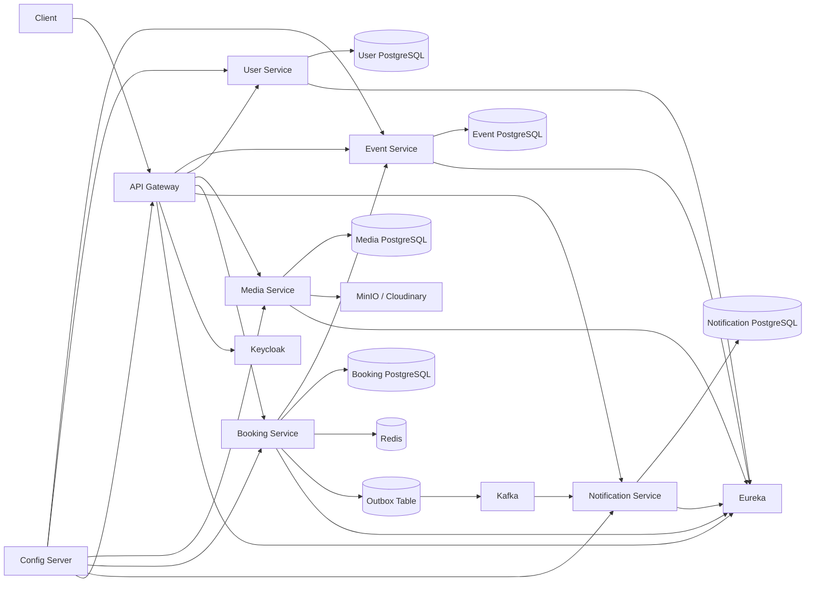

The project currently has five business services:

| Service | Responsibility |
|---|---|
| Event Service | Events, categories, ticket types, lifecycle and organizer ownership |
| User Service | Application user profiles linked to Keycloak identities |
| Media Service | File uploads, media metadata and storage-provider abstraction |
| Booking Service | Reservations, capacity, booking lifecycle and booking event publishing |
| Notification Service | Kafka consumption, idempotency and persistent user notifications |

---

## Services

### Event Service

The Event Service owns the event domain.

It handles:

- event creation and updates
- categories
- ticket types
- ticket prices and capacities
- organizer ownership rules
- event lifecycle transitions

Current event states include:

```text
DRAFT
PENDING_APPROVAL
PUBLISHED
REJECTED
CANCELLED
COMPLETED
```

The Booking Service reads event and ticket information from this service before creating a booking.

### User Service

The User Service stores application-specific user profile data while Keycloak remains responsible for authentication.

Profile data includes:

- first name
- last name
- email
- phone
- avatar media ID
- Keycloak user ID

The authenticated user is linked to the application through the JWT subject.

### Media Service

The Media Service handles file uploads and media metadata.

It supports:

```text
MinIO
Cloudinary
```

Both storage providers are hidden behind the same storage abstraction, so the active provider can be selected by configuration.

For normal file access, the service generates signed or presigned URLs rather than streaming file content through the application.

### Booking Service

The Booking Service contains the main reservation logic.

It handles:

- booking creation
- event and ticket validation
- atomic ticket-capacity protection
- temporary Redis reservations
- booking confirmation
- booking cancellation
- automatic expiration
- booking ownership rules
- booking lifecycle event publishing

Booking states:

```text
PENDING
CONFIRMED
CANCELLED
EXPIRED
```

### Notification Service

The Notification Service consumes booking lifecycle events from Kafka and stores user notifications in its own PostgreSQL database.

Handled event types:

```text
BOOKING_CREATED
BOOKING_CONFIRMED
BOOKING_CANCELLED
BOOKING_EXPIRED
```

It also exposes endpoints for retrieving the authenticated user's notifications and marking a notification as read.

---

## Main Application Flows

### Organizer Flow

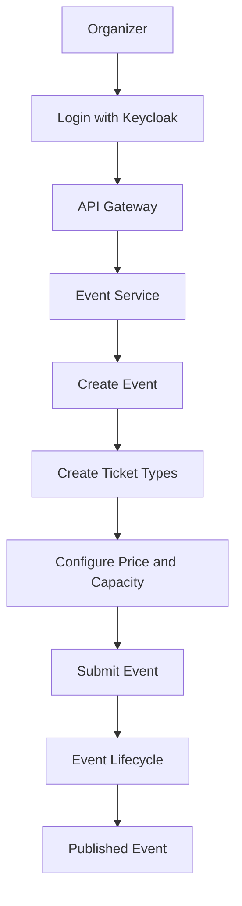

An event normally starts as `DRAFT`. It can be edited while it is in a valid editable state, then submitted and moved through its lifecycle before becoming available for booking.

### User Booking Flow

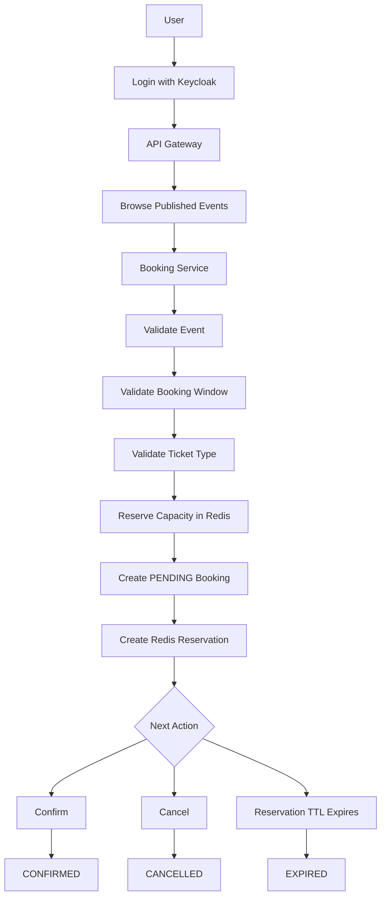

Before a booking is created, the Booking Service validates that:

- the event exists
- the event is published
- the booking window is open
- the ticket type exists
- the ticket type belongs to the requested event
- enough capacity is available

---

## Booking Lifecycle

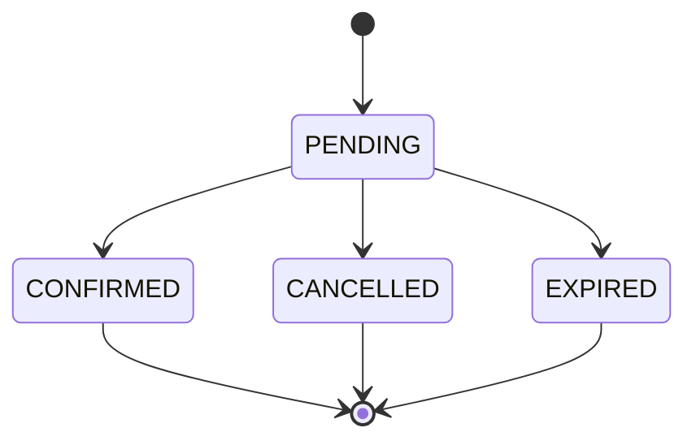

`PENDING` means the temporary reservation is still active.

`CONFIRMED` means the booking is finalized. The temporary reservation is removed, while the ticket capacity remains allocated to the confirmed booking.

`CANCELLED` means a pending booking was cancelled and its reserved capacity was released.

`EXPIRED` means the Redis reservation TTL elapsed before confirmation, so the booking was expired and its reserved capacity was released.

---

## Redis Reservations and Capacity

Redis has two separate responsibilities in the booking flow.

### Temporary reservation

Each pending booking creates a key like:

```text
booking:reservation:{bookingId}
```

The reservation has a configurable TTL. The current local configuration uses:

```text
10 minutes
```

When the key expires, Redis emits a keyspace-expiration event. The Booking Service listens for that event and expires the related pending booking.

### Capacity protection

Reserved ticket quantity is tracked using keys like:

```text
booking:reserved:{ticketTypeId}
```

The capacity check and reservation are performed atomically so concurrent requests cannot oversell the same ticket type.

Conceptually:

```text
currently reserved + requested quantity <= ticket capacity
```

If the requested quantity would exceed capacity, the booking is rejected.

---

## Event-Driven Notifications

Booking lifecycle changes are published asynchronously.

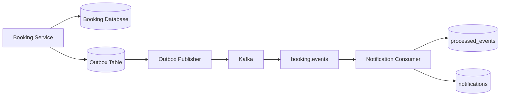

Published event types:

```text
BOOKING_CREATED
BOOKING_CONFIRMED
BOOKING_CANCELLED
BOOKING_EXPIRED
```

The event contract contains:

```text
messageId
eventType
aggregateId
occurredAt
userId
eventId
ticketTypeId
quantity
totalAmount
```

The Kafka message key is the booking ID. This keeps messages for the same booking on the same partition and helps preserve ordering for that booking.

---

## Transactional Outbox

The Booking Service does not publish directly to Kafka inside the business transaction.

Doing that would create a dual-write problem: the database write could succeed while Kafka publishing fails, or the opposite could happen.

Instead, the booking change and the outbox record are written in the same database transaction.

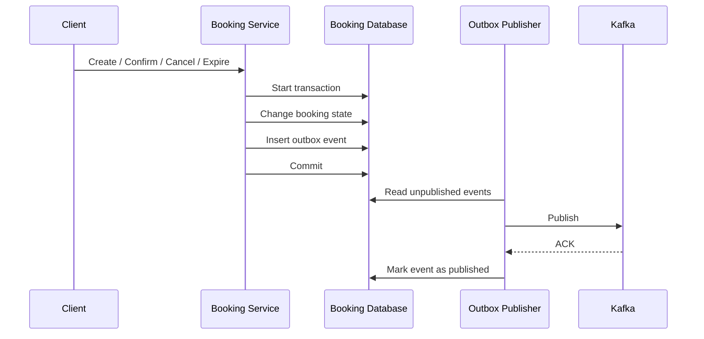

The publisher later reads unpublished outbox records and sends them to Kafka.

The delivery model is **at least once**, not exactly once.

---

## Idempotent Consumer

At-least-once delivery means the same Kafka message may be delivered more than once.

The Notification Service protects itself with a `processed_events` table keyed by `messageId`.

Conceptually, the consumer performs:

```sql
INSERT INTO processed_events (...)
ON CONFLICT (message_id) DO NOTHING;
```

If the insert succeeds, the event is processed.

If the message ID already exists, the event is treated as a duplicate and skipped.

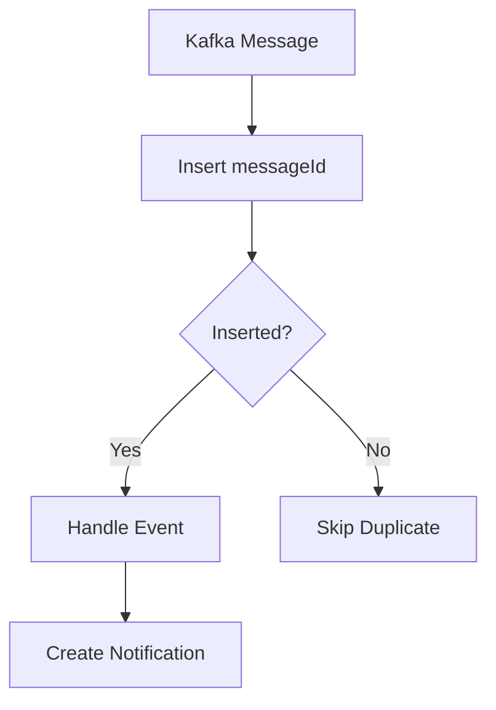

The processed-event record and the generated notification are stored in the same database transaction. If notification handling fails, the transaction rolls back.

---

## Notification API

### Get the current user's notifications

```http
GET /api/notifications
```

Only notifications belonging to the authenticated user are returned.

### Mark a notification as read

```http
PATCH /api/notifications/{notificationId}/read
```

The lookup uses both the notification ID and the authenticated user ID, so a user cannot mark another user's notification as read.

---

## Authentication and Authorization

Authentication is handled by Keycloak using OAuth2 and OpenID Connect.

The project uses:

```text
Authorization Code Flow
PKCE
JWT
OAuth2 Resource Server
```

Realm roles:

```text
USER
ORGANIZER
ADMIN
```

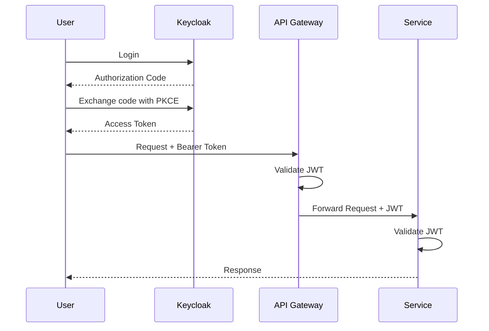

The API Gateway validates incoming JWTs, and the individual services validate them again.

The application user ID is taken from:

```text
JWT subject
```

Realm roles are read from:

```text
realm_access.roles
```

---

## Service-to-Service Communication

The Booking Service communicates synchronously with the Event Service when it needs current event or ticket information.

The call uses a load-balanced Spring `RestClient`, and Eureka resolves the target service instance.

The original user's JWT is propagated to the downstream request.

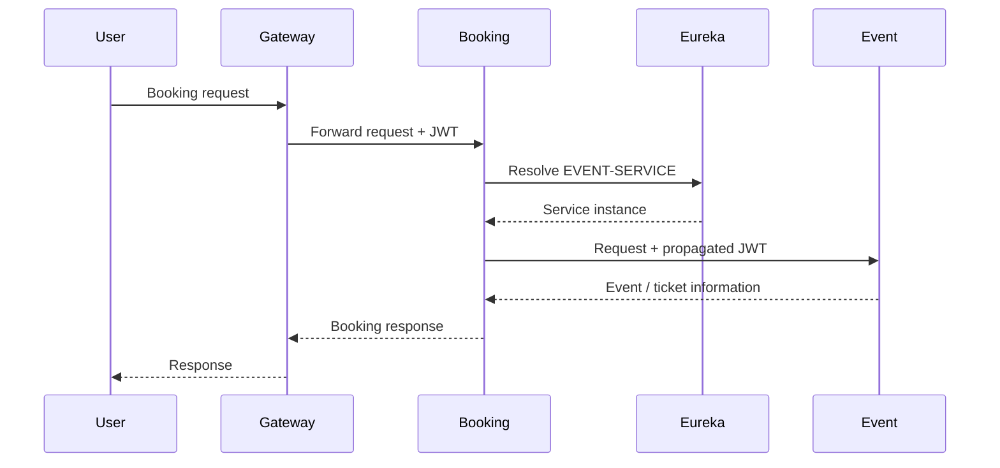

---

## Resilience

The Booking Service depends on the Event Service during booking operations.

Resilience4j is used around that dependency with:

- Retry
- Circuit Breaker

Temporary service failures can be retried, while errors such as resource-not-found are not retried.

If the Event Service is unavailable or the circuit is open, the Booking Service returns a service-unavailable response rather than exposing an internal failure.

---

## Observability

The observability stack includes:

```text
Micrometer
Prometheus
Grafana
OpenTelemetry
Tempo
```

### Metrics

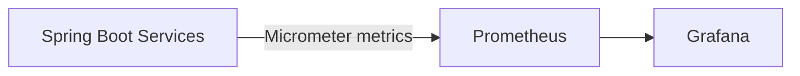

Prometheus scrapes service metrics and Grafana is used for visualization.

### Distributed tracing

OpenTelemetry is used to trace requests across service boundaries.

A typical trace can look like:

```text
API Gateway
    ->
Booking Service
    ->
Event Service
```

Trace data is exported to Tempo.

---

## Media Storage

The Media Service supports MinIO and Cloudinary behind a common storage abstraction.

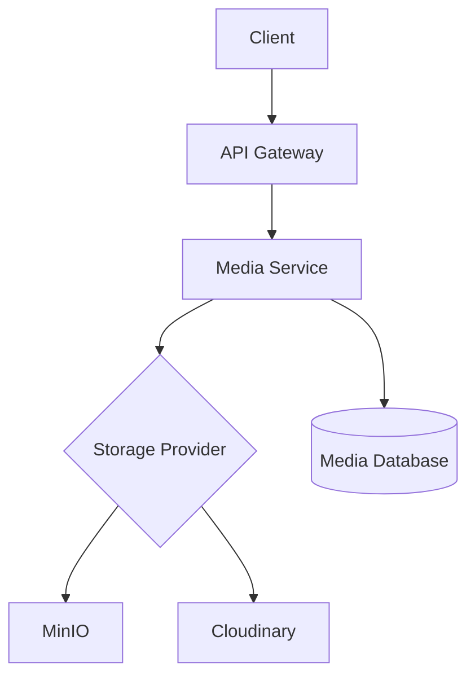

The service stores media metadata in PostgreSQL and the file itself in the configured storage provider.

---

## API Gateway and Swagger

Spring Cloud Gateway is the main public entry point.

Default local address:

```text
http://localhost:8081
```

Main routes:

```text
/api/events/**         -> EVENT-SERVICE
/api/users/**          -> USER-SERVICE
/api/media/**          -> MEDIA-SERVICE
/api/bookings/**       -> BOOKING-SERVICE
/api/notifications/**  -> NOTIFICATION-SERVICE
```

### Central Swagger

Swagger UI is exposed through the API Gateway:

```text
http://localhost:8081/swagger-ui/index.html
```

The dropdown contains:

```text
Event Service
Booking Service
User Service
Media Service
Notification Service
```

The OpenAPI documents are also routed through the Gateway:

```text
/event-service/v3/api-docs
/booking-service/v3/api-docs
/user-service/v3/api-docs
/media-service/v3/api-docs
/notification-service/v3/api-docs
```

Swagger authentication uses Keycloak Authorization Code Flow with PKCE.

---

## Database Strategy

EventHub follows the Database-per-Service pattern.

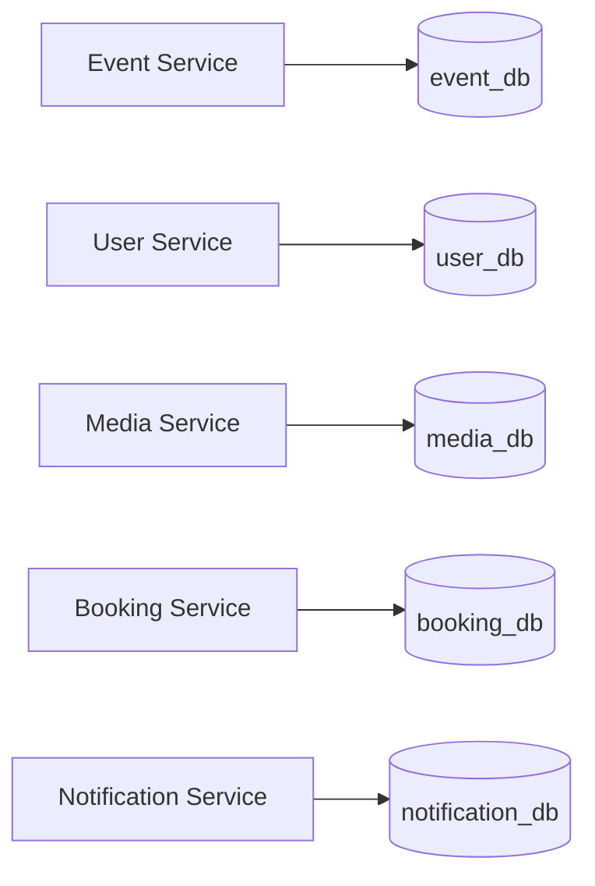

Services do not directly read or modify another service's database.

Database schema changes are managed with Flyway.

---

## Technology Stack

| Area | Technology |
|---|---|
| Language | Java 17 |
| Framework | Spring Boot 4.1.1 |
| Cloud | Spring Cloud 2025.1.3 |
| API Gateway | Spring Cloud Gateway |
| Service Discovery | Netflix Eureka |
| Centralized Configuration | Spring Cloud Config |
| Authentication | Keycloak 26.7.3 |
| Security | OAuth2 Resource Server / JWT |
| Persistence | Spring Data JPA / Hibernate |
| Database | PostgreSQL 16 |
| Database Migration | Flyway |
| Temporary Storage | Redis 7 |
| Messaging | Apache Kafka 4.3.1 |
| Resilience | Resilience4j 2.4.0 |
| Metrics | Micrometer / Prometheus |
| Visualization | Grafana |
| Distributed Tracing | OpenTelemetry / Tempo |
| Object Storage | MinIO / Cloudinary |
| API Documentation | SpringDoc OpenAPI / Swagger UI |
| Build | Maven |
| Infrastructure | Docker Compose |

---

## Local Ports

| Component | Port |
|---|---:|
| Event Service | 8080 |
| API Gateway | 8081 |
| User Service | 8082 |
| Keycloak | 8083 |
| Media Service | 8084 |
| Booking Service | 8085 |
| Notification Service | 8086 |
| Eureka Server | 8761 |
| Config Server | 8888 |
| Kafka | 9092 |
| Redis | 6379 |
| MinIO API | 9000 |
| MinIO Console | 9001 |
| Prometheus | 9090 |
| Grafana | 3000 |
| Tempo | 3200 / 4317 / 4318 |
| Event PostgreSQL | 5433 |
| User PostgreSQL | 5434 |
| Keycloak PostgreSQL | 5435 |
| Media PostgreSQL | 5436 |
| Booking PostgreSQL | 5437 |
| Notification PostgreSQL | 5438 |

---

## Running the Project

The current development setup runs infrastructure with Docker Compose and the Spring Boot services locally.

### 1. Start infrastructure

From the project root:

```bash
docker compose up -d
```

The active Compose configuration starts the required infrastructure, including PostgreSQL databases, Redis, Kafka, Keycloak, MinIO and the observability stack.

### 2. Start Config Server

```bash
cd config-server
mvn spring-boot:run
```

Default port:

```text
8888
```

### 3. Start Eureka

```bash
cd discovery-server
mvn spring-boot:run
```

Eureka dashboard:

```text
http://localhost:8761
```

### 4. Start API Gateway

```bash
cd api-gateway
mvn spring-boot:run
```

### 5. Start the business services

Start:

```text
event-service
user-service
media-service
booking-service
notification-service
```

Each service loads its configuration from Spring Cloud Config and registers with Eureka.

Recommended startup order:

```text
Docker infrastructure
        |
        v
Config Server
        |
        v
Eureka
        |
        v
API Gateway
        |
        +--> Event Service
        +--> User Service
        +--> Media Service
        +--> Booking Service
        +--> Notification Service
```

---

## Configuration Repository

Service configuration is stored in a separate local Git repository:

```text
config-repo
```

The Config Server currently reads it from the local filesystem:

```yaml
spring:
  cloud:
    config:
      server:
        git:
          uri: file:///D:/EventHub/config-repo
```

The configuration repository is intentionally kept local for now because it contains environment-specific configuration.

Before publishing it separately, secrets and environment-specific values should be moved to environment variables or a dedicated secrets-management solution.

---

## Project Structure

```text
EventHub/
|-- api-gateway/
|-- booking-service/
|-- config-server/
|-- discovery-server/
|-- event-service/
|-- media-service/
|-- notification-service/
|-- user-service/
|-- config-repo/
|-- monitoring/
|   |-- prometheus/
|   `-- tempo/
|-- docker-compose.yml
`-- README.md
```

Each service is an independent Spring Boot application.

---

## V1 Scope

The current V1 focuses on completing the main backend architecture and business flow.

Implemented areas include:

```text
Event management
Event lifecycle
Ticket types
User profiles
Media uploads
Keycloak authentication
Role-based authorization
Booking reservations
Atomic ticket-capacity protection
Booking confirmation
Booking cancellation
Automatic booking expiration
Spring Cloud Config
Eureka service discovery
API Gateway
Flyway migrations
Resilience4j
Prometheus metrics
Grafana dashboards
OpenTelemetry tracing
Tempo
Kafka
Transactional Outbox
Idempotent Kafka consumer
Notification persistence
Notification REST API
Central Swagger
```

The goal of V1 is not to include every production feature. It is to have a complete, understandable backend where the main architectural choices can be explained and demonstrated.

---

## Future Improvements

The following items are intentionally outside the current V1 scope.

### Kafka reliability

- Dead Letter Topic
- more advanced retry policies
- poison-message handling
- Kafka-specific observability dashboards

### Outbox scaling

For multi-instance deployments, the current publisher can later be extended with approaches such as:

```text
Database locking
SKIP LOCKED
Batch claiming
CDC
```

### Reservation recovery

A production version can add a scheduled reconciliation process as a safety net for Redis expiration events.

Redis capacity counters can also be rebuilt from persistent booking data during recovery.

### Payments

The current confirmation flow does not include a real payment provider.

A later version could add:

```text
Payment Service
Payment provider integration
Payment webhooks
Refund workflow
```

### Notification channels

The Notification Service currently stores in-app notifications.

Future channels could include:

```text
Email
SMS
Push Notifications
WebSocket notifications
```

### Deployment and operations

Future deployment work can include:

```text
Dockerfiles for every service
Kubernetes
Helm
CI/CD
Secret management
Production profiles
```

### Testing

A larger production version should include broader automated coverage such as:

```text
Unit tests
Integration tests
Contract tests
End-to-end tests
Kafka integration tests
Container-based infrastructure tests
```

---

## Reliability Model

The asynchronous booking flow currently follows this model:

```text
Database transaction
        +
Transactional Outbox
        +
Kafka at-least-once delivery
        +
Idempotent consumer
```

The system does not claim exactly-once processing.

Instead, it accepts that a message may be delivered more than once and makes the consumer safe to execute repeatedly for the same `messageId`.

---

## Status

EventHub V1 is feature-complete for the current backend scope.

The next work is mainly around documentation, automated testing, deployment, secret management and production hardening.
